# Detecção de Anomalias em Equipamentos com Dados de Acelerômetro
Sistema de monitoramento inteligente de vibração com ESP32 + ADXL345, que aplica análise estatística e espectral (FFT) para detectar anomalias em tempo real.

## Objetivo
Este projeto tem como objetivo construir um modelo capaz de captar as frequências de vibração de um equipamento, enviar essas informações via Wi-Fi para um servidor HTTPS, e utilizar uma API em Python para análise em tempo real. A detecção de anomalias é realizada por um algoritmo treinado com dados de funcionamento normal e anômalo forçado, utilizando técnicas como a Distância de Mahalanobis e Análise de Fourier (FFT).

## Hardware utilizado
- ESP32
- ADXL345

## Resumo rápido da ligação via I2C:
| Pino do ADXL345 | Pino do ESP32 | Função                              | Descrição técnica                                                                 |
|------------------|----------------|--------------------------------------|-----------------------------------------------------------------------------------|
| VCC              | 3.3V           | Alimentação                         | Fornece tensão de 3.3V para o funcionamento do sensor ADXL345                    |
| GND              | GND            | Terra comum                         | Estabelece referência de zero volts (terra) compartilhada entre os dispositivos  |
| SDA              | GPIO 21        | Dados I2C (Serial Data)             | Linha de dados para comunicação I2C, envia e recebe informações do sensor        |
| SCL              | GPIO 22        | Clock I2C (Serial Clock)            | Linha de clock que sincroniza a comunicação I2C entre ESP32 e sensor             |
| SDO              | GND            | Seleção de endereço I2C           | Quando ligado ao GND, define o endereço I2C|
| CS               | 3.3V           | Seleção de modo de comunicação      | Mantido em nível alto (3.3V) para ativar o modo I2C e desabilitar o modo SPI     |

<details>
<summary> Esquema de montagem do sistema </summary>

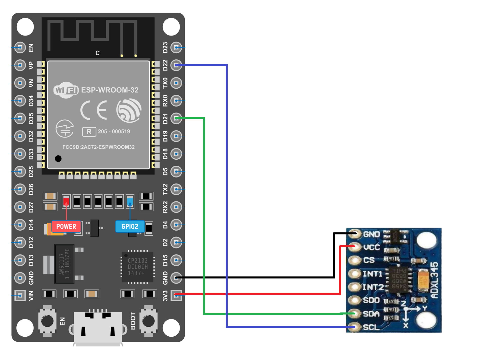

</details>
<details>
<summary> Sistema montado </summary>

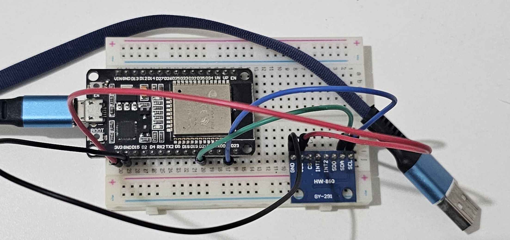

</details>

## Recursos e Funcionalidades
### Aquisição e Transmissão
- Captação da frequência de vibração de funcionamento de equipamentos monitorados
- Envio das informações via WiFi para um servidor HTTPS local
- Agrupamento e geração de arquivos em acordo com o número de amostras

### Processamento e Detecção
- Extração de múltiplas métricas estatísticas e espectrais dos dados do acelerômetro, incluindo:
    - Estatísticas no domínio do tempo (média, desvio padrão, RMS, amplitude, curtose)
    - Correlação entre os eixos (X, Y, Z)
- Transformada de Fourier (FFT) e Distância de Mahalanobis para detecção de anomalias
- Análise de frequência via FFT (picos espectrais, energia média, quantidade de harmônicos)
- Utilização das features estatísticas e espectrais para treinamento algoritmos de aprendizado de máquina.
- Determinação da distância de Mahalanobis como critério para indicativo de anomalia

### Avaliação
- Comparação visual de espectros FFT entre estados normais e anômalos
- Criação de testes automatizados para testar todas as funções utilizadas durante o treinamento, tanto para a obtenção das estatísticas quanto para a plotagem dos gráficos.
- Levantamento das métricas envolvendo o modelo resultante, tais como acurácia, precisão, recall, f1 e curva ROC

## Tecnologias utilizadas
- Arduino IDE
- Linguagem C++
- Servidor (Protocolo HTTPS e Streamlit)
- Python (Pandas, Numpy, Matplotlib, Seaborn, Scipy e Scikit-Learn)
- Jupyter Notebook
- Git/Github
- Pytest (Testes automatizados)

## Coleta dos dados
### ESP32
Lógica criada através da interface do ArduinoIDE, faz uma checagem inicial dos componentes, posteriormente uma verificação de conexão com o servidor e finalmente habilita um timer para a realização da coleta dos dados fornecidos pelo sensor ADXL345 e envio para um servidor HTTPS de maneira periódica.

### Servidor
Servidor feito em python com apenas o método de inicialização e o POST definidos.

### Criação dos dados
As 200 amostras oriundos do ESP32 são recebidos, agrupados e salvos em arquivos CSV no diretório característico.

## Tratamento de dados
- Os dados coletados inicialmente foram apenas de vibração, portanto, os tratamentos necessários foram remover a componente DC e a separação dos valores de acordo com os eixos captados (X, Y, Z)
- Para a obtenção de algumas métricas, os dados foram selecionados, limpos e randomizados, de modo a garantir o menor overfitting, com a maior precisão.
- Extração de métricas estatísticas e espectrais para alimentar o modelo de ML

### Visualização das métricas do treino
Resultado da Classificação:
| precision | recall | f1-scores | support
| :--------- | :------: | :---------: | :-------: |
| `Normal` | 0.75 | 0.94 | 0.83 | 50 |
| `Anomaly` | 0.92 | 0.68 | 0.78 | 50 |
| `Accuracy` | | | 0.81 | 100 |
| `Macro avg` | 0.83 | 0.81 | 0.81 | 100 |
| `Weighted avg` | 0.83 | 0.81 | 0.81 | 100 |

`AUC Score`: 0.859

- `Accuracy Score`: Proporção de previsões corretas (positivas e negativas) sobre o total.
- `Precision Score`: Proporção de predições positivas que realmente são positivas.
- `Recall Score`: Proporção de casos positivos corretamente detectados.
- `F1 Score`: Média harmônica entre precisão e recall

Para os dados, são encontrados:

- Alta precisão para anomalias(0.92): Quando diz que é anomalia, ele geralmente está certo.
- Alta recall para normal(0.94): Ele acerta quase todos os normais.
- Baixo recall para anomalias(0.68): Ele está deixando de identificar 32% das anomalias reais, o que pode ser crítico dependendo do contexto (segurança, falha de máquina).
- F1-Score equilibrado mas ligeiramente melhores para a classe "normal".
- Accuracy - 81%, razoável, mas não é a melhor métrica isoladamente em cenário com anomalias (classes desbalanceadas ou impacto alto dos erros.).
- AUC Score: 0.859
- AUC > 0.85 geralmente indica um bom modelo

Portanto, ele está sabendo diferenciar bem entre as duas classes (normal e anomalia) ao variar o limiar de decisão.

### Explicações de algumas métricas
`Mean`: Retorna a média de cada eixo, para o caso, o valor médio da aceleração nos eixos x, y e z. É possível observar que a magnitude dos valores são bem maiores no eixo Z, quando comparados aos presentes nos eixos x e y.

`Variance`: Mede a dispersão dos dados em torno da média.

`Kurtosis`: Indica o achatamento e como é feito a distribuição de dados coletados.

`Entropia`: quantifica o grau de desordem no sinal.

- Baixa entropia: sinal mais regular, repetitivo e previsível.

- Alta entropia: sinal mais caótico, com variações imprevisíveis.

`Energia`: Mede a intensidade total da vibração em cada eixo.

`Distância de mahalonobis`: leva em conta a correlação entre as variáveis e a dispersão dos dados, assim ao calcular a distância para novos pontos, valores grandes indicam que o ponto está longe do padrão normal, podendo ser uma anomalia.

`Distribuição da distância de Mahalanobis`: Para dados multivariados normalmente distribuídos, o quadrado da distância de Mahalanobis segue uma distribuição Qui-quadrado (Chi-squared) com 𝑘 graus de liberdade, onde 𝑘 é o número de features.

Isso é útil para definir thresholds estatísticos de corte para detectar anomalias, por exemplo:
- Escolher um limiar que corresponda a 95% da distribuição (percentil 95 da qui-quadrado).
- Pontos com distância acima desse limiar são considerados anômalos.

`Matriz de confusão`: Tabela que resume o desempenho de um modelo de classificação, coompara os valores reais com os valores previstos e permite calcular métricas como precisão, recall, acurácia, entre outras.

| | Previsto: Normal (0) | Previsto: Anomalia (1)
| :--------- | :------: | :---------: |
| `Real: Normal (0)` | TP (Verdadeiro Negativo) | FP (Falso Positivo) |
| `Real: Anomalia (1)` | FN (Falso Negativo) | TN (Verdadeiro Positivo) |

- True Positive (TP): Anomalias corretamente identificadas como anomalias.

- True Negative (TN): Normais corretamente identificados como normais.

- False Positive (FP): Normais classificados erradamente como anomalias.

- False Negative (FN): Anomalias classificadas erradamente como normais.

`Curva ROC`: Usada para avaliar a performance de um modelo de classificação binária. Ela mostra a relação entre:

Taxa de Verdadeiros Positivos (TPR, também chamada de Recall)

Taxa de Falsos Positivos (FPR) em diferentes limiares de decisão.

Eixo da Curva:

- Eixo X: FPR = FP / (FP + TN) → Falsos Positivos

- Eixo Y: TPR = TP / (TP + FN) → Verdadeiros Positivos

Sendo, a curva mais próxima do canto superior esquerdo indica melhor desempenho, a linha diagonal indica um modelo aleatório. Portanto, o ideal é que a curva ROC fique bem acima da diagonal.

### Gráficos para análises dos dados
<details>
<summary> Comparações de plot com DC </summary>

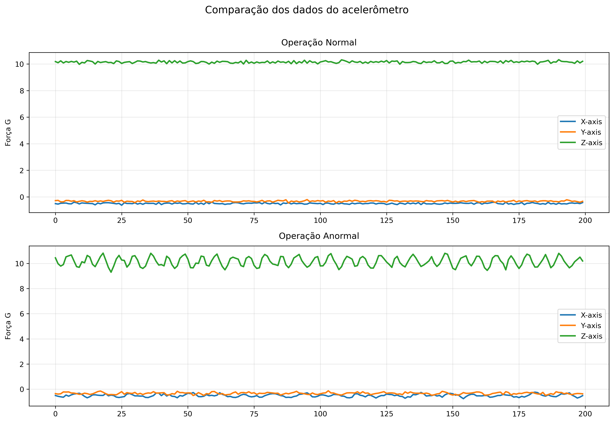
</details>

<details>

<summary> Comparações de plot sem DC </summary>

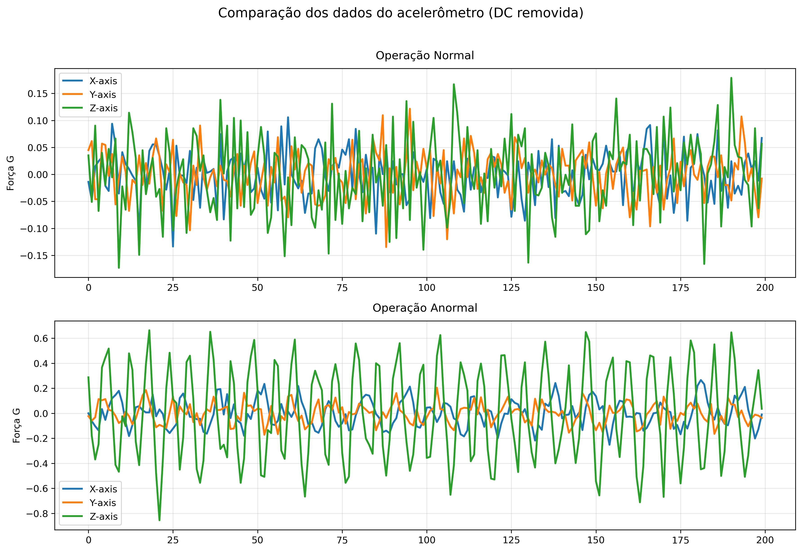
</details>


<details>
<summary> RAW com n_samples = 10 </summary>

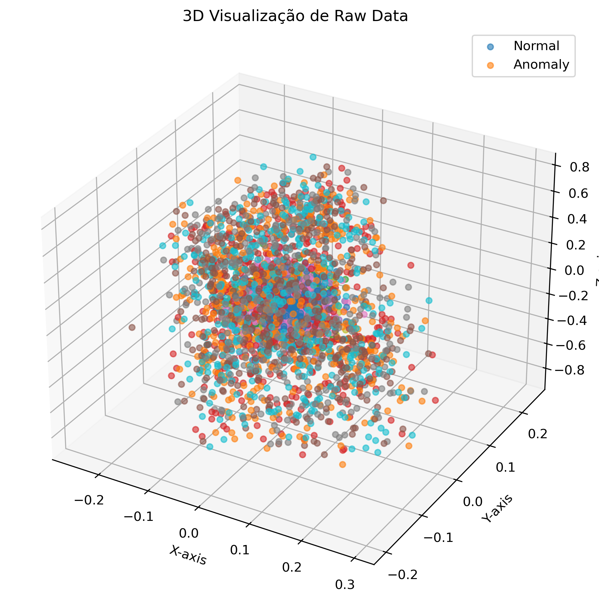

</details>

<details>
<summary> RAW com n_samples = 200 </summary>

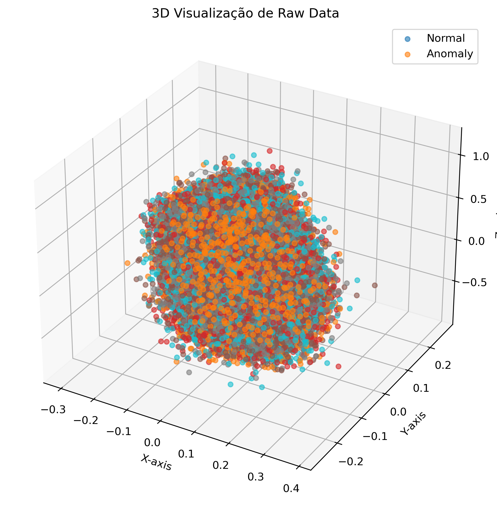
</details>

<details>
<summary> Média das magnitudes FFT </summary>


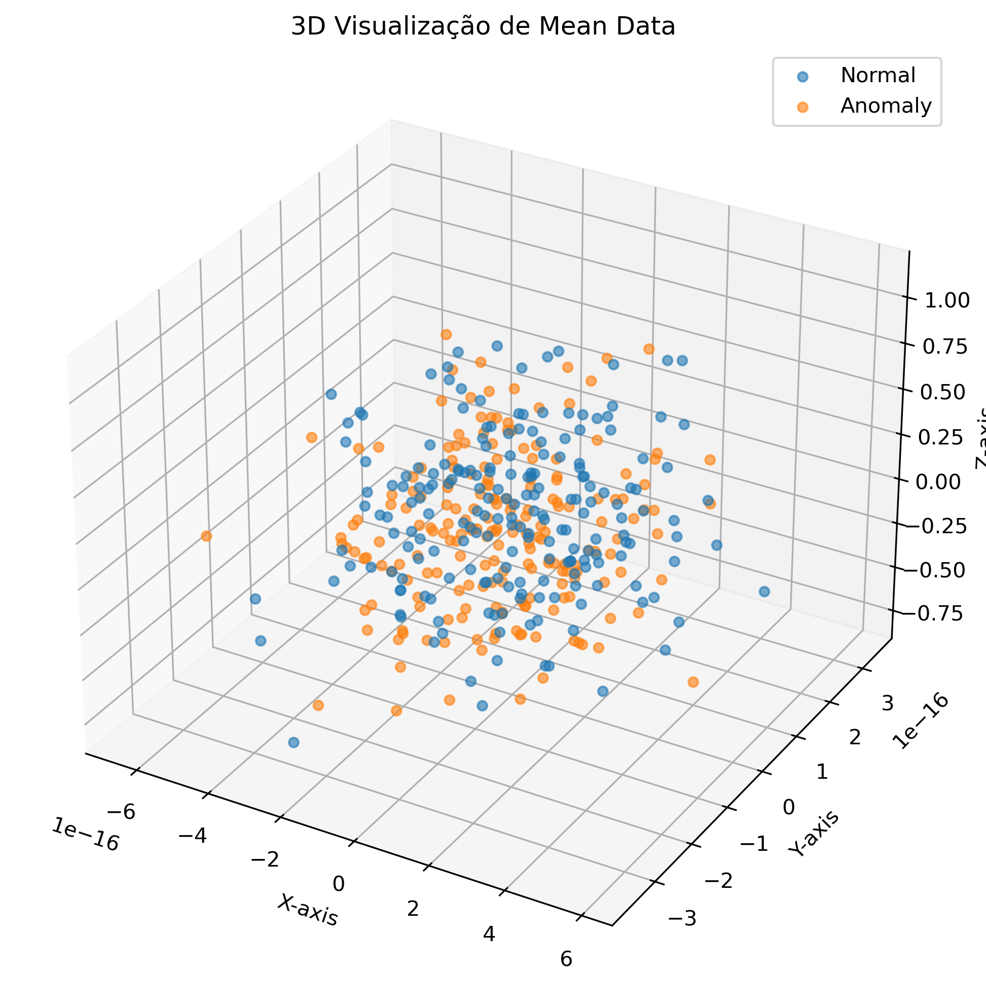

</details>

<details>
<summary> Variância </summary>


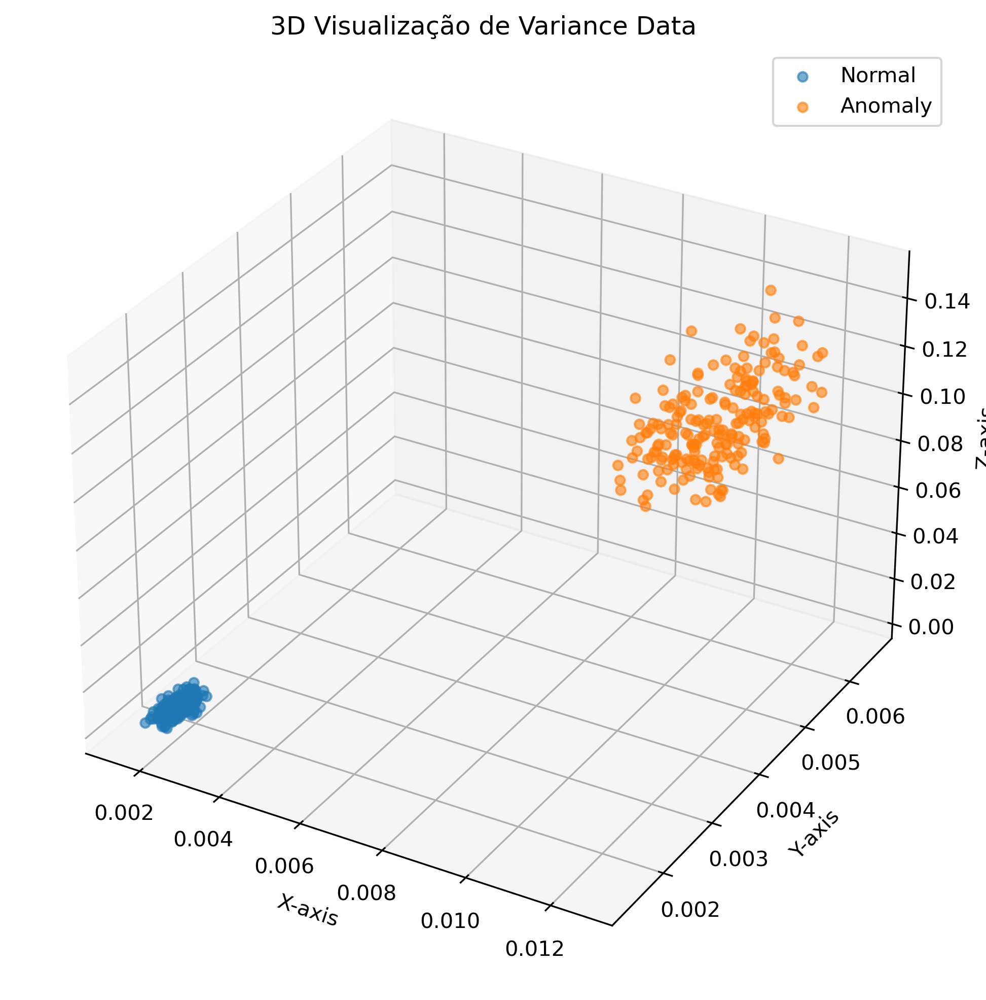

</details>

<details>
<summary> Kurtosis </summary>


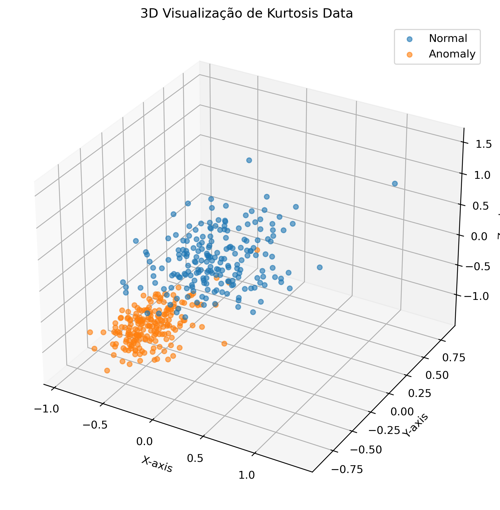

</details>
<details>

<summary> Entropia </summary>


</details>
<details>

<summary> Energia </summary>


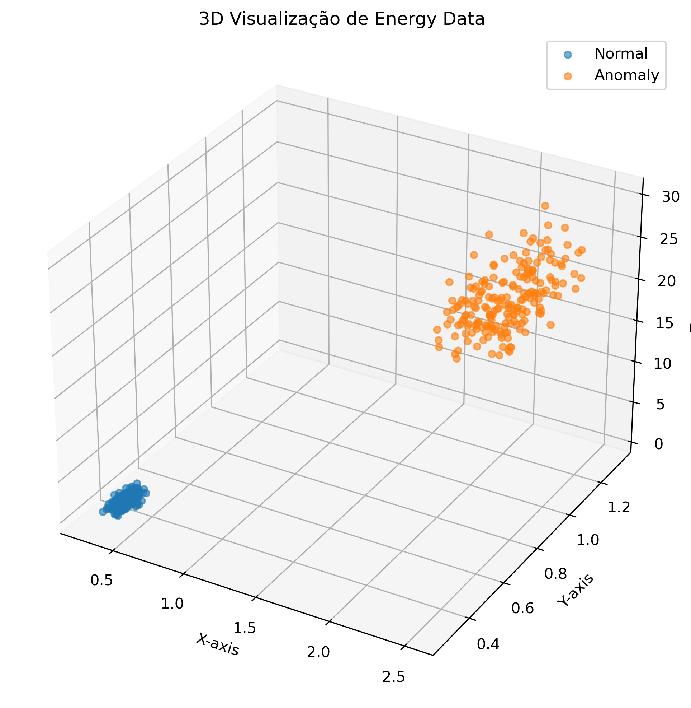
</details>
<details>
<summary> Histogramas </summary>

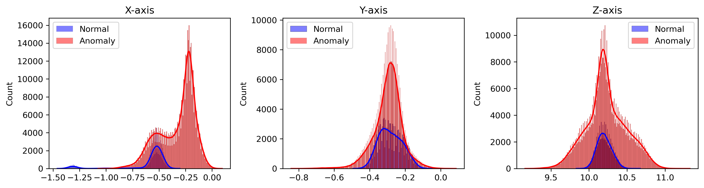
</details>
<details>
<summary> Comparação de FFT </summary>


</details>
<details>
<summary> Distribuição das distâcias </summary>

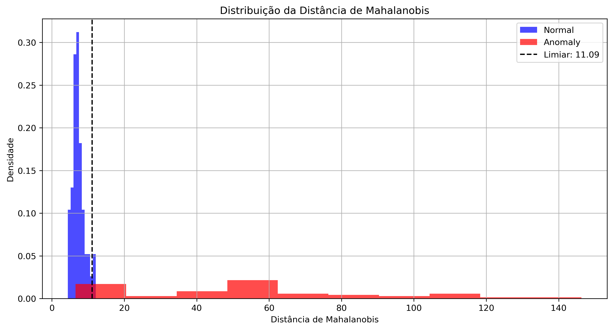

</details>
<details>
<summary> Matriz de confusão </summary>


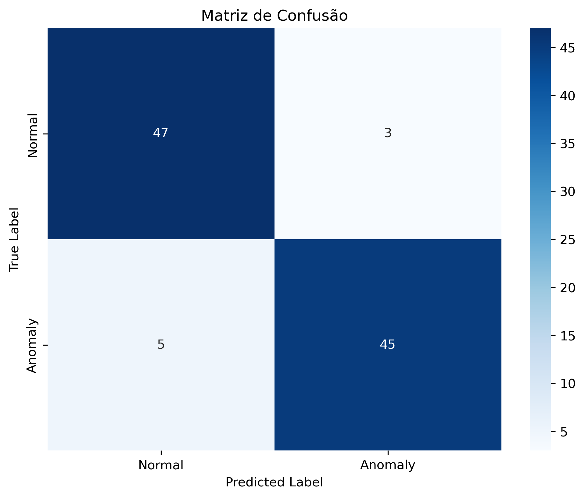
</details>
<details>
<summary> Curva ROC </summary>

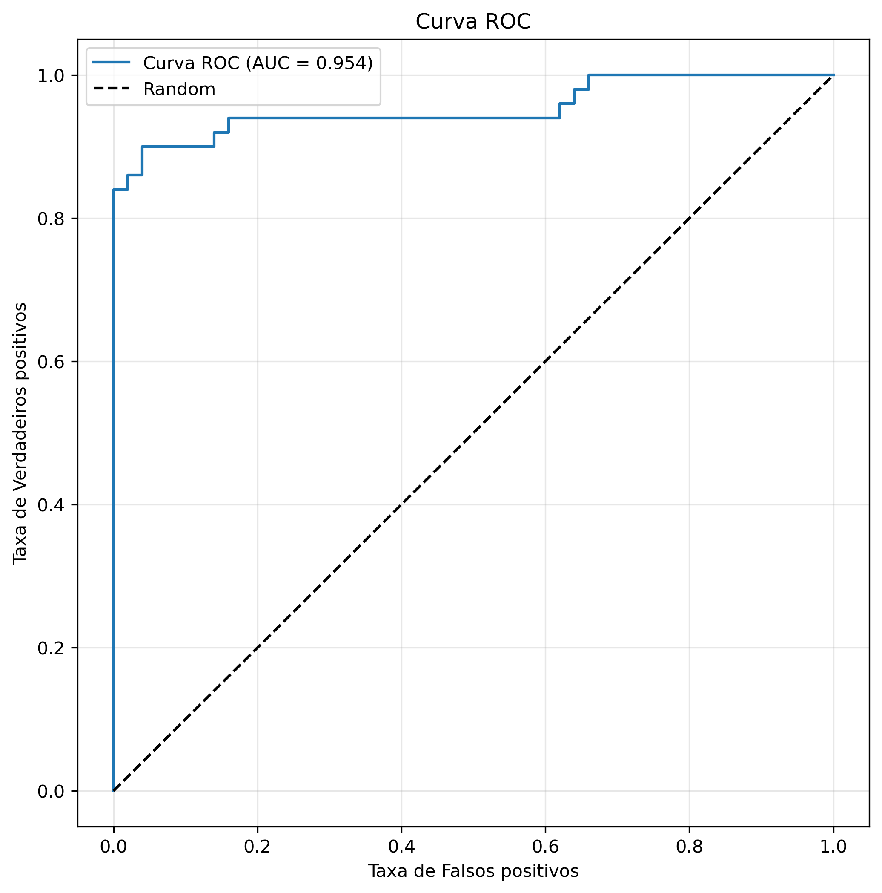

</details>

## Análise dos gráficos obtidos

- `Comparação com DC`: Com a presença da componente DC(valor médio) o dado obtido no eixo Z se encontra próximo a 10, sinalizando, portanto que se encontra com a presença da gravidade, dificultando portanto distorcer os gráficos e dificultar as leituras, já que as variações estarão em componentes de alta frequência e não no valor médio. Isso é identificado, quando ao observar o gráfico, temos uma escala de captação completamente distinta, fazendo com que os eixos X e Y, aparentem ser muito mais constantes.
- `Comparação sem DC`: Sem o ruído da componente DC(valor médio) é possível observar as frequências desejadas e permitindo acompanhar os valores adequadas nas componentes, como as magnitudes dos dados estão ajustadas é possível observar a variação que ocorre, em especial, no eixo Z, que se encontra representado sem o efeito da gravidade.
- `RAW com n_samples = 20 e RAW com n_samples = 200`: A concentração das amostras estão normais, sendo muito mais densas conforme o crescimento do samples.
- `Média`: As médias para os eixos X e Y são muito próximas a 0, indicando normalidade, os pequenos valores encontrados em Z sinalizam que o sensor pode não se encontrar completamente alinhado, e portanto, com um leve efeito da gravidade remanescente, intensidade essa que para casos com anomálias são amplificados.
- `Variância`: Conforme esperado, para casos com anomalias a dispersão dos dados é superior ao encontrados para dados normais.
- `Kurtosis`: Valores baixos de Kurtosis, assim como esperado, já que não irão ocorrer alterações bruscar na magnitude das informações durante a realização da coleta, mas sim entre coletas, indicando portanto se tratar de um gráfico no estilo platykurtic.
- `Entropia`: Para os sinais com anomalia, foi encontrado uma maior entropia, indicando uma maior irregularidade nos dados coletados.
- `Energia`: Os dados com anomalias, possui uma intensidade de vibração bem superior aos dados normais.
- `Histogramas`: Sinaliza a concentração dos picos de alto valores no eixo Z, em especial, quando a anomalia é sinalizada, sendo um bom indicador para a progressão de uma falha.
- `Comparação de FFT`: Trata-se de um espectro de frequência, sinalizando claramente a presença de uma anomalia, a qual, pode ser identificada conforme o comportamento e a intensidade de acordo com os valores em que os picos ocorrem.
- `Distribuição da Distância de Mahalanobis`: Sinalizando que para os dados normais, a grande maioria se encontra abaixo do threshold definido, e assim, a quantidade de falsos positivos que serão classificados tende a ser mínima, logo, passando do threshold utilizado, pode ser classificado como anomalia.
- `Matriz de Confusão`: Responsável por indicar as métricas utilizadas para o treinamento, em especial, permitindo aprimoramento do algoritmo de acordo com o critério que estivermos buscando melhorar.
- `Curva ROC`: Sinalizando que o desempenho do nosso algoritmo encontra-se superior ao de um modelo aleatório, e com um indice de acerto satisfatório.


## Confiança na detecção de anomalias e suavização
O sistema calcula uma métrica de confiança associada à detecção de anomalias, baseada principalmente na Distância de Mahalanobis em relação ao limiar definido.

#### Como a confiança é calculada?
Quando a distância é muito superior ao limiar, a confiança tende a 100%, indicando alta certeza da anomalia, quando a distância é próxima ao limiar, a confiança diminui, indicando incerteza.

### Dashboard
Com o objetivo de tornar o resultado mais visual, foi criado um dashboard simplificado utilizando streamlit, nele é possível fazer a inserção do CSV com os dados, que são processados e armazenados em um histórico, enquanto o app está rodando, esse histórico é utilizado para o cálculo da confiança.

Retornando assim, a confiança, distância de mahalanobis, threshold, valores dos features relativos ao ultimo conjunto de dados inseridos e se foi identificado como uma anomalia ou não.

Idealmente essa inserção é substituida por uma coleta em tempo real com atualização do status do sistema.

<details>

<summary> Cabeçalho do streamlit antes da inserção dos dados </summary>

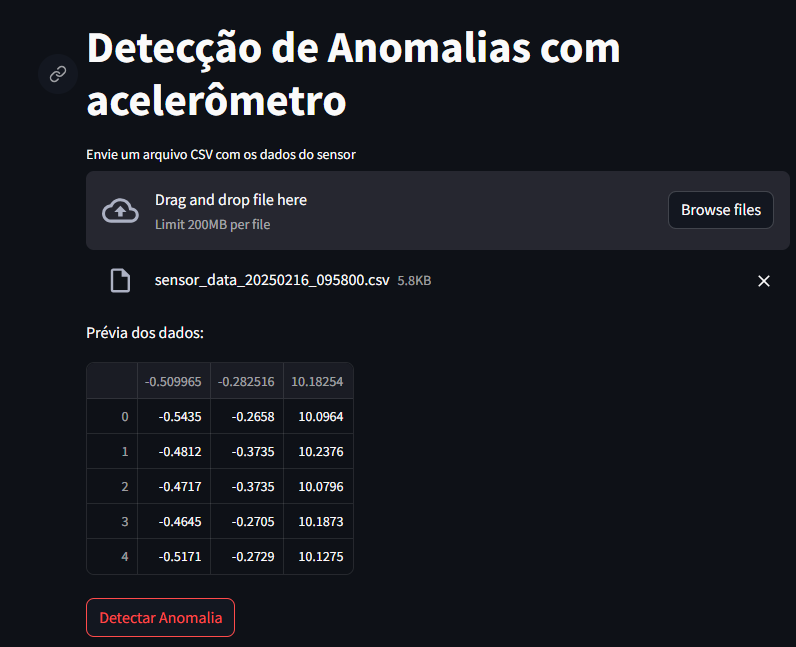
</details>

<details>
<summary> Visualização após inserção dos dados da primeira amostra </summary>

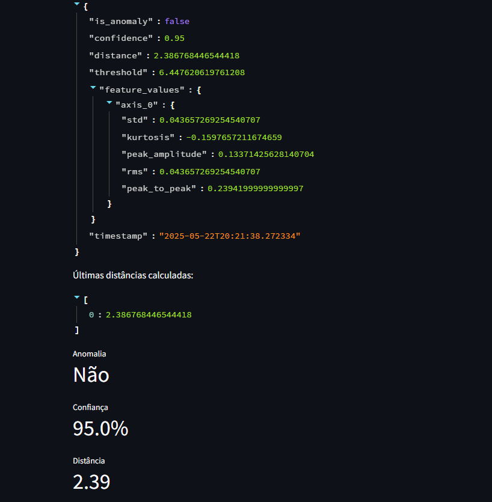
</details>

<details>
<summary> Visualização dos dados após inserção de várias amostras </summary>

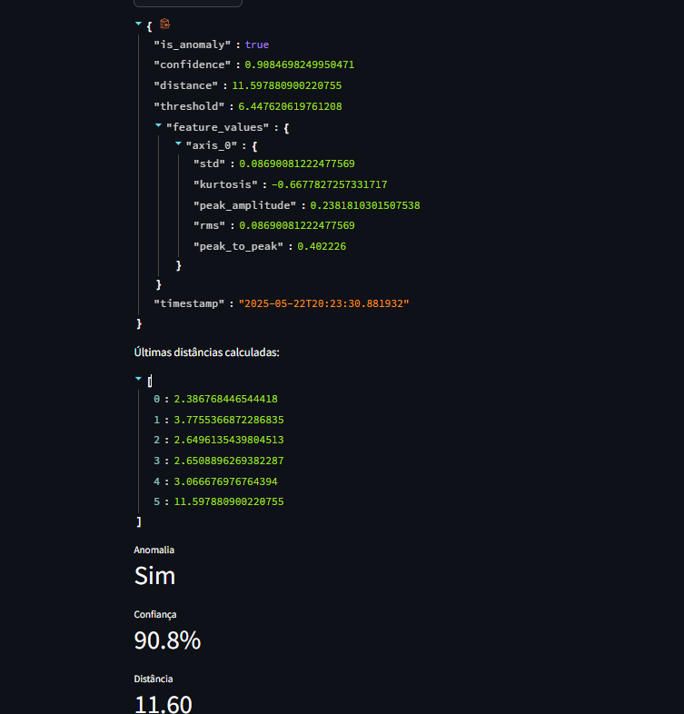
</details>

#### Desafios observados
Durante testes, foi identificado que a confiança apresentava oscilações abruptas entre amostras, como resultado de uma inserção não contínua, diferente do que seria o previsto acontecer no dia a dia, uma vez que, caso os dados estivessem sendo observados em intervalos constantes a falha iria progredir de modo gradual e não sofrer alterações abruptas, pensando em solucionar essas flutuações, que em cenários de falhas podem causar falsas impressões de recuperação ou de agravamento repentino, foi implementada uma suavização exponencial.

#### Solução aplicada: suavização exponencial
Foi implementada uma técnica de suavização exponencial da confiança:

```
confidence_smooth = alpha * confidence_atual + (1 - alpha) * confidence_smooth_anterior
```

Onde alpha controla o grau de suavização.

#### Benefícios práticos observados
- Tornou a confiança uma métrica mais confiável de tendência.
- Reduziu alarmes falsos em situações de oscilações naturais do sistema.
- Permitiu observar claramente a evolução progressiva de degradação quando presente.

## Arquivos e módulos principais

<code>streamlit_app.py</code>: 
- Responsável por fornecer uma interface visual interativa e em tempo real, onde:
- Os dados coletados do acelerômetro são processados ao vivo.
- O modelo é aplicado em tempo real.
- Exibe as principais métricas (distância, limiar, confiança).
- Mostra visualizações interativas como espectros FFT.
- Permite acompanhar ao vivo o comportamento dos sensores e o status de anomalia.

<code>utils.py</code>:
- Módulo central que organiza todas as funções reutilizáveis do projeto, incluindo:
- Extração de features estatísticas e espectrais dos dados do acelerômetro.
- Cálculo da distância de Mahalanobis.
- Função de detecção de anomalia com cálculo de confiança e suavização integrada.
- Funções de visualização gráfica (espectros FFT, distribuição das distâncias, etc).
- Carregamento do modelo e do scaler.
- Atualização dinâmica de confiança suavizada ao longo do tempo.
- Este módulo foi estruturado para permitir máxima reutilização, clareza e expansão futura.

<code>training.py</code>:
- Responsável pela realização do treinamento e criação do modelo utilizado para análise posterior, além da determinação de critérios essenciais como o limiar da distância de Mahalonobis, fundamental para classificação na presença de anomalia.

<code>analysis.py</code>:
- Módulo principal para organização das funções utilizadas para obtenção das métricas estatísticas, gráficos gerados, comparações de resultados, amplamente aplicado durante o training.

<code>test_features.py</code>:
- Algoritmo responsável pela realização dos testes automatizados das funções presentes majoritariamente em analysis.

<code>server.py</code>:
- Utilizado para criação do server HTTPS que irá receber e agrupar as informações durante a coleta dos dados realizadas pelo sensor ADXL345 e passadas ao ESP32.

<code>server_streamlit.py</code>:
- Responsável pela criação do servidor que irá hospedar o streamlit, e portanto, possuir o método POST que recebe o arquivo CSV com os dados coletados, aplica o algoritmo treinado e retorna o resultado da distância de Mahalanobis.

## Principais aprendizados
- A utilização de métricas mais eficientes, permitem que o algoritmo utilizado seja otimizado ao ponto de ser possível identificar individualmente cada componente presente no equipamento analisado.
- Entendimento prático de métricas de avaliação e otimização do modelo de treinamento.
- A importância de enriquecer a representação e treinamento dos dados, combinando estatísticas básicas com análise de frequência (FFT) e correlação entre eixos, o que resultou em um modelo mais inteligente e confiável.
- Aprimoramento do algoritmo de aprendizado através da utilização de métricas estatísticas.
- Aplicação de técnicas de suavização para métricas voláteis.
- Criação de uma pipeline de análise de sinais eficientes e extensível.
- Criação de testes automatizados com Pytest.
- Criação de um dashboard responsivo com streamlit.

## Testes automatizados
O projeto conta com testes automatizados utilizando pytest, garantindo a confiabilidade das principais funções, são eles:
- Verificação do shape das features extraídas
- Testes de integridade
- Testes com mock de arquivos e funções
- Testes visuais com comparação de espectros

<details>
<summary> Exemplo: Comparação de espectros FFT (normal x anomalia) </summary>

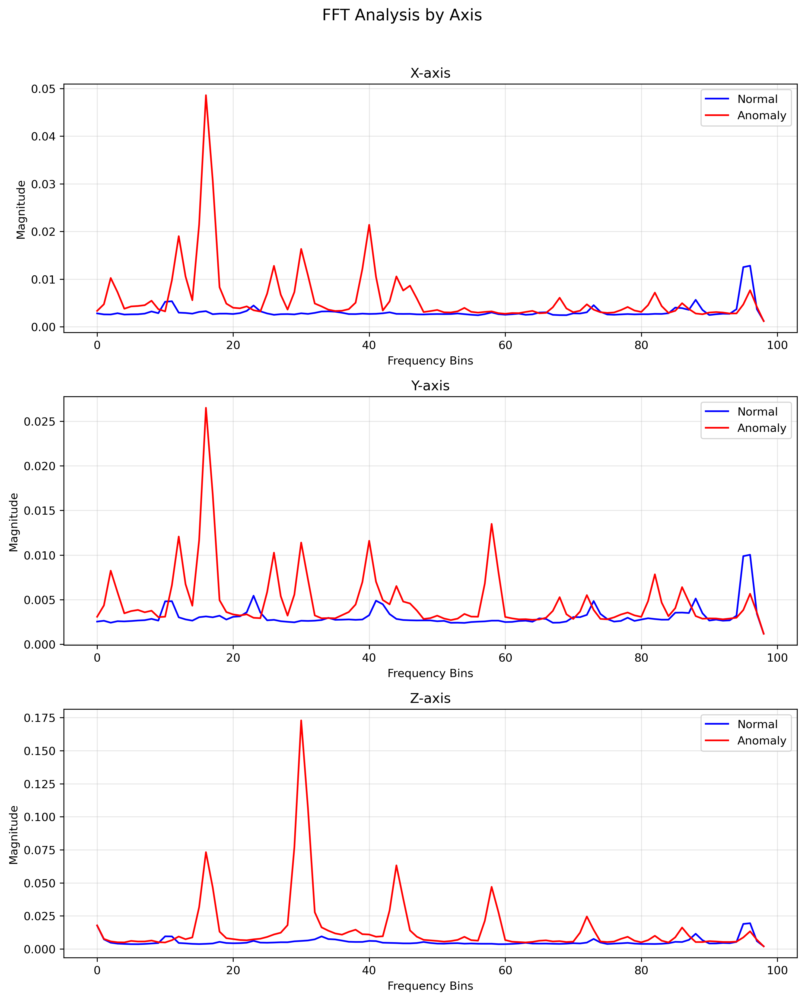
</details>

## Comandos úteis
```
# Instalar dependências
pip install -r requirements.txt

# Executar os testes
python -m pytest -v ProjetoSensor/tests

# Executar o streamlit app
python -m streamlit run app/streamlit_app.py
```

## Upgrades e melhorias
- A maneira recomendada para aprimoramento desse projeto seria inicialmente de garantir uma conexão segura entre o microcontrolador e o servidor, migração do servidor para a Cloud e cadastro individual dos componentes presentes dentro do equipamento.
- Ao identificar individualmente os componentes internos do equipamento, torna-se possível prever qual parte está apresentando falha. Essa previsão pode ser feita com base nos padrões detectados no espectro de frequência, tornando a análise mais precisa.
- Criação de um dashboard que gere em tempo real um acompanhamento dos sensores que estão ativos, mantendo sob supervisão e evitando a necessidade de intervenção fora da programação.
- Substituição do envio de informações de pacote de arquivos para acompanhamento em tempo real, permitindo inicio das rotinas de coleta, acompanhamento da progressão da anomalia.
- Criação de um sistema de alerta conforme a gravidade das anomalias identificadas, com capacidade de envio das informações para um aplicativo próprio, um grupo de emails e até mesmo números de whatsapp, permitindo uma rápida programação para intervenção ou até mesmo parada imediata, para casos mais críticos, que possam vir a danificar seriamente o equipamento.
- Foi implementada uma função de extração de características que amplia significativamente a capacidade do modelo de detectar padrões complexos de anomalias. Essa função combina métricas no domínio do tempo, análise de correlação entre os eixos e espectro de frequência via FFT. Essa abordagem proporciona uma visão mais rica e completa do comportamento do equipamento, aumentando a precisão do modelo de detecção, porém é possível refinar e otimizar essa função e consequentemente o algoritmo.

## Contribuições
Sinta-se à vontade para fazer adições a esse projeto, enviar sugestões ou relatar bugs.

## Agradecimentos
O tema desenvolvido nesse projeto é bem semelhante ao que que foi realizado no meu Trabalho de Conclusão de Curso desenvolvido no início de 2022 pela Unicamp. No entanto, ao me deparar com um vídeo explicativo no canal do YouTube do [Daniel Romero](https://www.youtube.com/watch?v=6MECPST996I&ab_channel=DanielRomero), decidi retomar o meu projeto e otimizá-lo, de acordo, com algumas ideias apresentadas pelo Daniel. A partir das explicações apresentadas, busquei aprimorar a proposta inicial. A ideia original do projeto consistia na produção de um conjunto capaz de captar e indicar previamente possíveis anomalias em equipamentos rotativos, utilizando um orçamento restrito.

Com a nova abordagem apresentada pelo Daniel, foi possível implementar um algoritmo inteligente, incorporar métricas mais eficientes (como as apresentadas em seu vídeo), além de realizar alterações em algumas funções e incluir testes unitários.

Para fins educacionais, apesar de ter realizado uma coleta própria de dados, optei por utilizar os mesmos dados apresentados pelo Daniel, pois, isso permitiu uma maior facilidade e confiança com relação aos dados obtidos, além de comparações diretas que auxiliaram na identificação de pontos de melhoria. Entre os aprimoramentos realizados, destacam-se: o refinamento das estatísticas utilizadas no treinamento, o uso de critérios de avaliação para o algoritmo, a definição dinâmica do limiar para a distância de Mahalanobis, a adição de um método de suavização exponencial da variação de confiança, a elaboração de gráficos e tabelas comparativas, a criação de testes automatizados, uma maior segmentação dos arquivos e alterações na forma de inserção dos dados no dashboard.

## Links Úteis
- [Linkedin](https://www.linkedin.com/in/lucas-belucci/)
